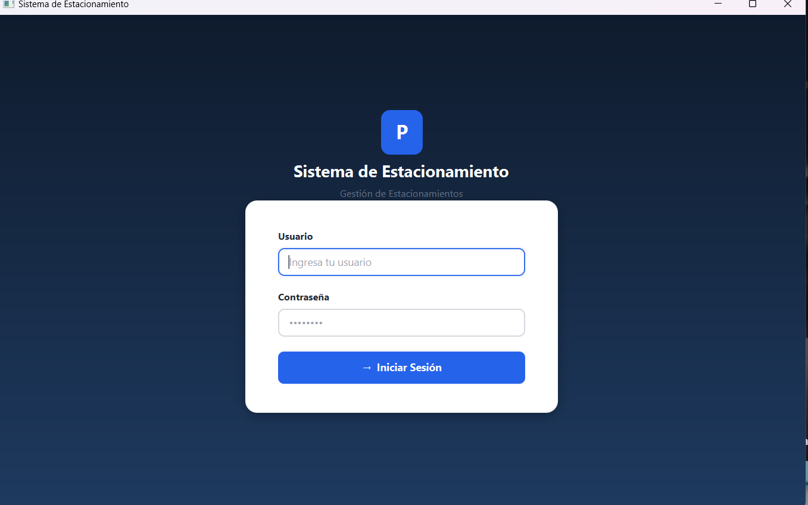
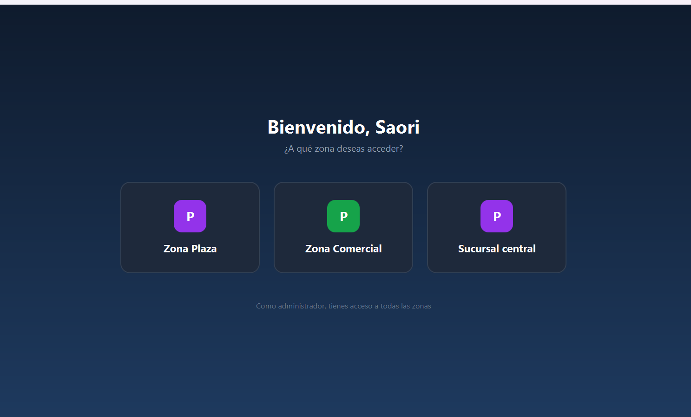
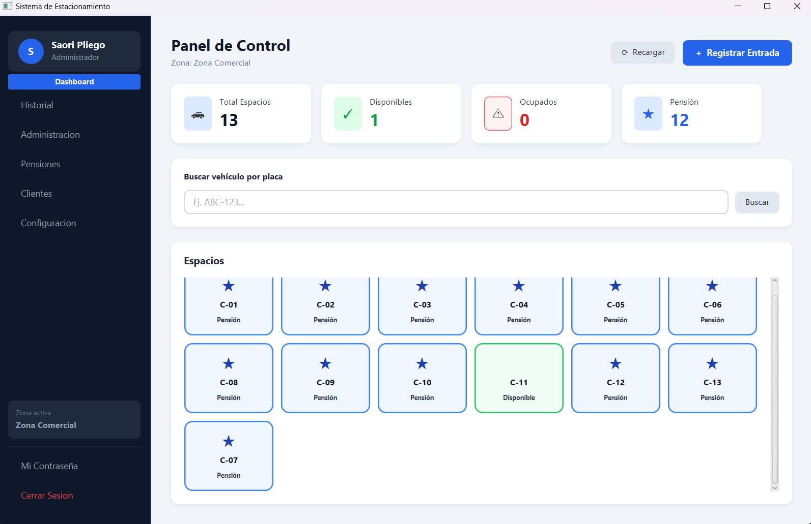
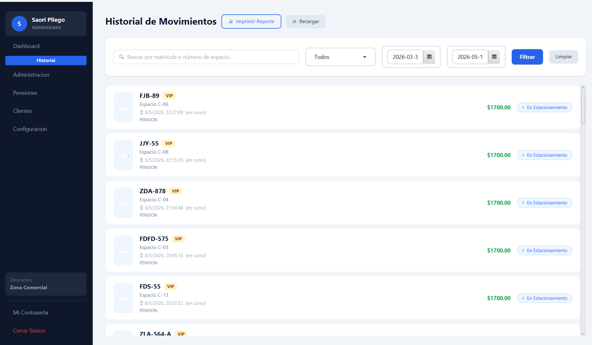
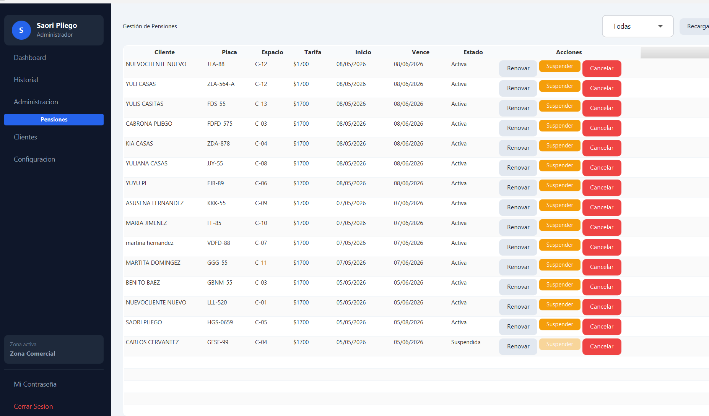
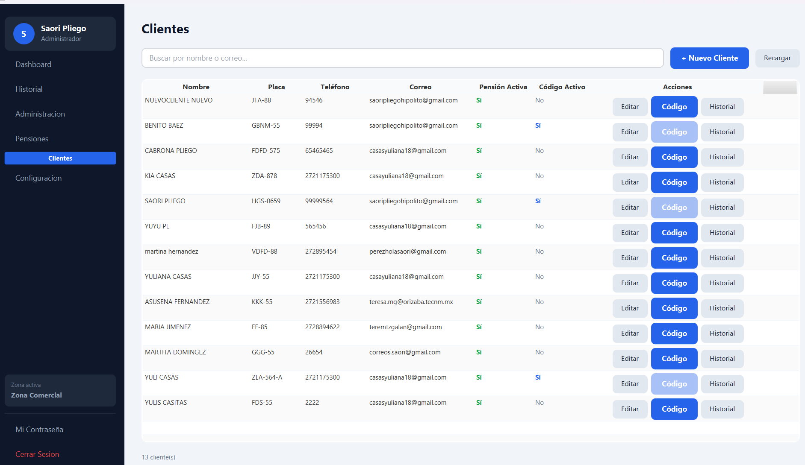
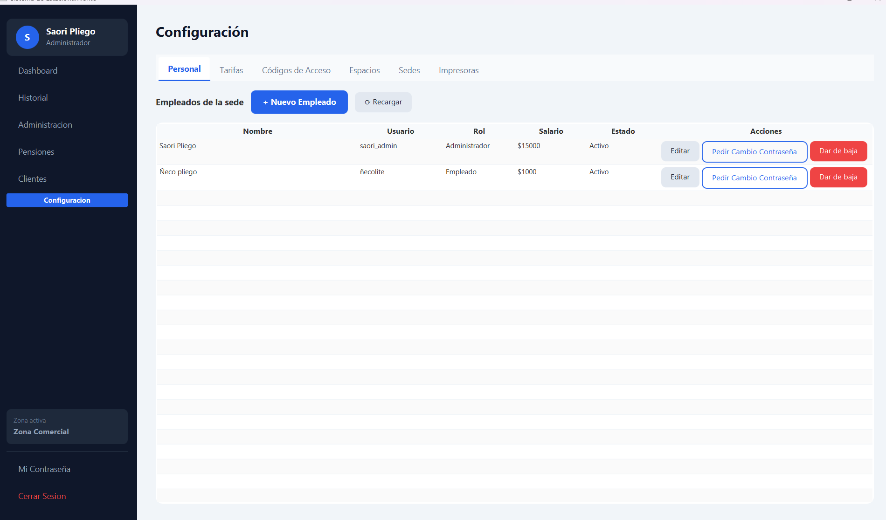
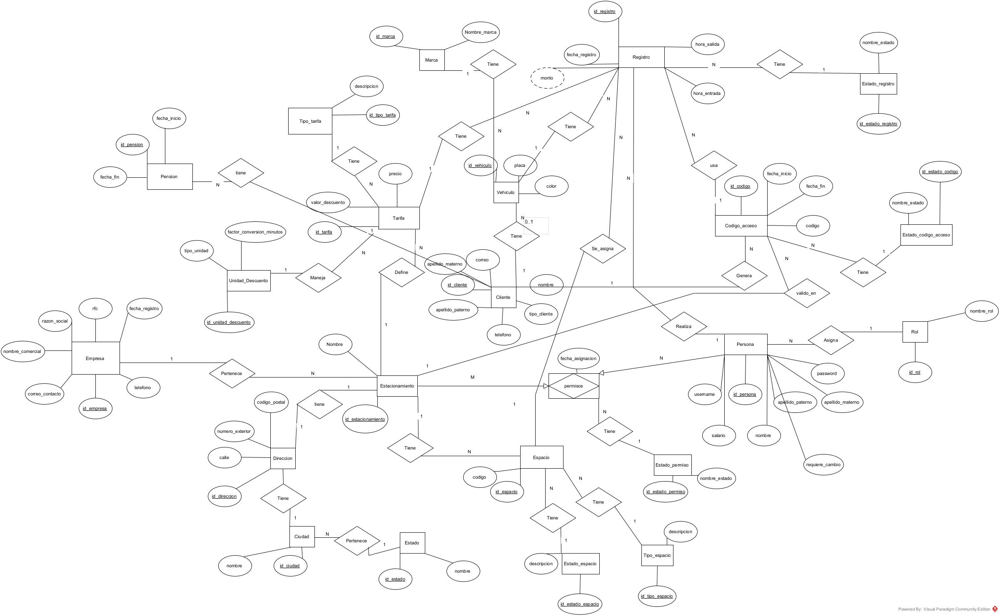

# Sistema de Gestión de Estacionamientos

Sistema desarrollado en **Java 17 + JavaFX 21** con persistencia en **MySQL (AWS RDS)**. Arquitectura MVC completa.

---

## Índice

1. [Arquitectura general](#1-arquitectura-general)
2. [Estructura de paquetes](#2-estructura-de-paquetes)
3. [Capa de Modelo](#3-capa-de-modelo)
4. [Capa DAO](#4-capa-dao)
5. [Capa de Servicios](#5-capa-de-servicios)
6. [Capa de Presentación — Controladores y Vistas](#6-capa-de-presentación--controladores-y-vistas)
7. [Utilidades](#7-utilidades)
8. [MODO\_DEMO — Pruebas sin base de datos](#8-modo_demo--pruebas-sin-base-de-datos)
9. [Flujos de negocio principales](#9-flujos-de-negocio-principales)
10. [Cómo ejecutar](#10-cómo-ejecutar)
11. [Base de datos](#11-base-de-datos)
12. [Dependencias](#12-dependencias)

---

## Capturas de pantalla

### Inicio de sesión


### Selección de estacionamiento


### Dashboard principal


### Historial de registros


### Gestión de pensiones


### Clientes


### Configuración


---

## 1. Arquitectura general

```
┌─────────────────────────────────────────────┐
│                  JavaFX UI                  │
│  FXML Views  ←→  Controllers  ←→  Services │
└─────────────────────────┬───────────────────┘
                          │
┌─────────────────────────▼───────────────────┐
│              Capa de Servicios               │
│  LoginServicio, RegistroServicio, ...        │
└─────────────────────────┬───────────────────┘
                          │
┌─────────────────────────▼───────────────────┐
│                 Capa DAO                     │
│  PersonaDAO, EspacioDAO, RegistroDAO, ...    │
└─────────────────────────┬───────────────────┘
                          │
┌─────────────────────────▼───────────────────┐
│           MySQL — AWS RDS                    │
│  instanciaestacionamiento.cniaoosykbny...    │
└─────────────────────────────────────────────┘
```

**Reglas de sesión:** `SessionManager` (singleton) persiste `Persona` logueada y `Estacionamiento` activo durante toda la sesión.

---

## 2. Estructura de paquetes

```
src/
├── main/
│   ├── java/com/estacionamiento/
│   │   ├── App.java                      ← Entry point JavaFX Application
│   │   ├── Launcher.java                 ← Wrapper para evitar error de módulo JavaFX
│   │   ├── modelo/                       ← Entidades del dominio
│   │   ├── dao/                          ← Acceso a datos (JDBC)
│   │   ├── servicio/                     ← Lógica de negocio
│   │   ├── controlador/                  ← Controladores JavaFX
│   │   └── util/                         ← Utilidades (SessionManager, NavegadorUI, …)
│   └── resources/com/estacionamiento/
│       ├── util/db.properties            ← Credenciales BD
│       └── vista/
│           ├── styles/app.css            ← Hoja de estilos global
│           ├── Login.fxml
│           ├── ZonaSeleccion.fxml
│           ├── MainLayout.fxml
│           ├── Dashboard.fxml
│           ├── Historial.fxml
│           ├── Administracion.fxml
│           ├── Configuracion.fxml
│           └── modales/
│               ├── RegistroEntrada.fxml
│               ├── RegistroSalida.fxml
│               └── FormularioCliente.fxml
└── pom.xml
```

---

## 3. Capa de Modelo

Todas las clases están en `com.estacionamiento.modelo`.

### Entidades principales

| Clase | Descripción | Campos clave |
|---|---|---|
| `Persona` | Usuario del sistema (admin/empleado) | `idPersona`, `username`, `password` (BCrypt), `rol`, `empresa`, `salario`, `requiereCambio` |
| `Estacionamiento` | Sede/parque | `idEstacionamiento`, `nombre`, `empresa`, `espaciosEstacionamiento`, `listaTarifas` |
| `Espacio` | Cajón individual | `idEspacio`, `codigo`, `estadoEspacio`, `tipoEspacio` |
| `Registro` | Sesión de estacionamiento | `idRegistro`, `vehiculo`, `espacio`, `tarifa`, `horaEntrada`, `horaSalida`, `monto`, `estadoRegistro` |
| `Vehiculo` | Vehículo registrado | `placa`, `marca`, `modelo`, `color`, `cliente` |
| `Cliente` | Cliente con pensión/frecuente | `nombre`, `tarifa`, `codigoAcceso` |
| `Tarifa` | Precio por tipo | `precio`, `tipoTarifa`, `tipoCobro`, `valorDescuento` |
| `CodigoAcceso` | Código alfanumérico para pensionistas | `codigo`, `fechaInicio`, `fechaFin`, `estadoCodigo` |
| `Empresa` | Empresa dueña de las sedes | `nombreComercial`, `estacionamientos[]` |
| `Permiso` | Autorización persona↔sede | `persona`, `estacionamiento`, `estadoPermiso` |

### Enumeraciones (tablas lookup)

| Clase | Valores |
|---|---|
| `Rol` | `ROL_ADMIN = 1`, `ROL_EMPLEADO = 2` |
| `EstadoEspacio` | `DISPONIBLE=1`, `OCUPADO=2`, `RESERVADO=3`, `PENSION=4` |
| `EstadoRegistro` | `RESERVADO=1`, `ACTIVO=2`, `FINALIZADO=3`, `CANCELADO=4` |
| `TipoTarifa` | `NORMAL=1`, `PENSION=2`, `EVENTO=3`, `ESPECIAL=4`, `CONVENIO=5` |
| `TipoCobro` | `HORA=1`, `MENSUAL=2`, `QUINCENAL=3` |
| `EstadoCodigoAcceso` | `ACTIVO=1`, `USADO=2`, `VENCIDO=3`, `CANCELADO=4` |
| `EstadoPermiso` | `ACTIVO=1`, `SUSPENDIDO=2`, `REVOCADO=3` |

Todas las constantes numéricas están centralizadas en `MisConstantes`.

### DTOs

| Clase | Uso |
|---|---|
| `ResumenGananciasDTO` | Resumen de ingresos por tipo de tarifa |
| `ResumenNominaDTO` | Total empleados y suma de salarios |
| `Reporte` | Datos para generar reporte HTML imprimible |
| `TicketEntrada` / `TicketSalida` | Datos para impresión de tickets |

---

## 4. Capa DAO

Todas en `com.estacionamiento.dao`. Cada DAO usa `DBConnection.getConnection()` (JDBC directo).

| DAO | Operaciones principales |
|---|---|
| `PersonaDAO` | `insertar`, `buscarPorUsername`, `cambiarContrasena`, `solicitoCambioContraseña` |
| `PermisosDAO` | `asignarPermisos`, `revocarTodosLosPermisos`, `listarPersonalPorEstacionamiento` |
| `EspacioDAO` | `insertarEspacio`, `espaciosEstacionamiento`, `listarEspaciosDisponibles`, `actualizarEstado`, `actualizarTipoEspacio` |
| `RegistroDAO` | `insertar`, `buscarPorId`, `registrarSalida`, `filtrarRegistros`, `listarPorFecha` |
| `TarifaDAO` | `insertar`, `actualizar`, `eliminar`, `listarPorEstacionamiento` |
| `VehiculoDAO` | `insertarVehiculo`, `buscarPorPlaca`, `actualizarVehiculo` |
| `ClienteDAO` | `insertar` (transaccional), `buscarPorId`, `listarTodos` |
| `CodigoAccesoDAO` | `insertar`, `buscarPorCodigo`, `buscarActivoPorIdCliente`, `listarPorCliente`, `listarPorEstacionamiento` ★, `actualizarEstado` |
| `EstacionamientoDAO` | `buscarPorId`, `listarPorEmpresa`, `insertarEstacionamiento` |
| `MarcaDAO` | `buscarPorID`, `listarTodas` |

> ★ `listarPorEstacionamiento` fue añadido en esta sesión para la pantalla de Configuración.

---

## 5. Capa de Servicios

Todas en `com.estacionamiento.servicio`.

### LoginServicio
```
procesarLogin(user, pass) → int
  1  = acceso directo (empleado, una sede)
  0  = elegir sede (admin o empleado multi-sede)
 -1  = credenciales inválidas
 -2  = sin permisos asignados

asignarEstacionamientoAdmin(Estacionamiento)
obtenerSedesAutorizadas(Persona) → List<Estacionamiento>
cambiarContraseña(idPersona, nuevaContraseña) → boolean
```

### RegistroServicio
```
registrarEntrada(placa, idMarca, horas, tarifa, cliente, espacio, modelo, empleado) → Registro
  - Si tarifa es POR_HORA: monto = precio × horas, calcula fecha_fin_plan
  - Si no: monto = precio fijo (mensual/quincenal/especial)
  - Llama EspacioService.ocuparCajon() → OCUPADO o PENSION (si hay cliente)

registrarSalida(idRegistro, horaSalida) → boolean
  - Llama CalculoServicio.calcularMontoTotal()
  - Actualiza BD con monto final
  - Llama EspacioService.liberarCajon()

obtenerRegistrosFiltrados(inicio, fin, idTipoTarifa) → List<Registro>
obtenerGanancias(List<Registro>) → ResumenGananciasDTO
```

### CalculoServicio — Lógica de cobro extra
```
calcularMontoTotal(Registro) → double

Periodo de gracia: 5 minutos
Cargo extra (sobre la hora base):
  +50%   si lleva entre 5-35 min de retraso
  +100%  si lleva entre 36-65 min de retraso

Descuento:
  - Por unidad: X horas/días gratis (requiere tarifa.unidadDescuento ≠ null)
  - Por porcentaje: % del total (requiere tarifa.valorDescuento ≠ null)
Resultado mínimo: $0

Nota: todos los campos de Registro/Tarifa son verificados contra null antes de usarse.
Si fecha_fin_plan es null (registro sin hora límite, e.g., pensión), no se aplica cargo extra.
```

### EspacioService
```
listarEspacios(idEst)            → todos
listarDisponibles(idEst)
listarOcupados(idEst)
ocuparCajon(idEspacio, cliente)  → OCUPADO si cliente=null, PENSION si cliente≠null
liberarCajon(idEspacio)          → vuelve a DISPONIBLE
reservarCajon(idEspacio)         → solo si está DISPONIBLE
```

### CodigoAccesoService
```
asignarCodigo(idCliente, idEst, fechaInicio, fechaFin) → CodigoAcceso
  - Código: "LOGIC-" + 8 chars aleatorios
  - Solo un código ACTIVO por cliente

validarAcceso(codigoStr) → boolean   ← estado ACTIVO y fecha vigente
cancelarCodigo(idCliente)
cancelarCodigoPorId(idCodigo)
obtenerCodigoActivo(idCliente) → CodigoAcceso
```

### PersonalService
```
construirPersonal(...) → Persona
añadirAdministradorYPermisos(Persona) → bool          ← permisos a TODAS las sedes
añadirEmpleadoYPermisos(Persona, Estacionamiento) → bool
añadirEmpleadoConPermisos(Persona, List<Estacionamiento>) → bool  ← multi-sede
darDeBajaAccesoPersonal(idPersona) → bool             ← revoca todos sus permisos
cambiarEmpleadoDeSede(idPersona, idNuevaSede) → bool
obtenerPersonalDeSedeActual() → List<Persona>
calcularResumenNomina(empleados) → ResumenNominaDTO
```

### TicketService
```
imprimirEntrada(Registro)    ← genera HTML + envía a impresora
imprimirSalida(Registro)     ← desglose: base + cargo extra - descuento
```

### ReporteService
```
generarReporteHTML(Reporte)
  ← HTML tipográfico con encabezado, cards de resumen y tabla
  ← Botón "Imprimir" integrado en el HTML
```

---

## 6. Capa de Presentación — Controladores y Vistas

### Flujo de pantallas

```
[Login]
   │
   ├─ resultado=1 (empleado, 1 sede) ──────────────────────┐
   └─ resultado=0 (admin, N sedes) → [ZonaSeleccion]        │
                                           │                  │
                                           └──────────────────▼
                                                     [MainLayout]
                                                          │
                                    ┌────────────────────┬┴──────────────────────┐
                                    ▼                    ▼                       ▼
                              [Dashboard]          [Historial]        [Administración] (Admin)
                                    │                                            │
                              ┌─────┴──────┐                         [Configuración] (Admin)
                              ▼            ▼
                      [RegistroEntrada] [RegistroSalida]
                              │
                      [FormularioCliente]
```

---

### LoginController — `Login.fxml`
- Valida campos no vacíos → llama `LoginServicio.procesarLogin()`
- Navega según resultado (1 → MainLayout, 0 → ZonaSeleccion)
- Error inline en rojo si credenciales incorrectas o sin permisos
- Soporta Enter en ambos campos

### ZonaSeleccionController — `ZonaSeleccion.fxml`
- "Bienvenido, {nombre}" dinámico
- Card generada por cada `Estacionamiento` autorizado
- Hover: aparece "Acceder →"; click: asigna sede y navega a MainLayout

### MainLayoutController — `MainLayout.fxml`
- Sidebar con avatar, nombre, rol y zona activa
- Menú Admin-only: Administración y Configuración (ocultos para empleados)
- Contenido se carga en `StackPane` central (sin reemplazar ventana)
- **Timer de inactividad:** 15 min → alerta + cierre automático
  - `MainLayoutController.reiniciarTimer()` es estático → todos los controladores lo llaman

### DashboardController — `Dashboard.fxml`
- Stats: Total / Disponibles / Ocupados / Pensión
- **FlowPane** con cajón por espacio coloreado según estado:
  - Verde (sin ícono) = disponible · Rojo `●` = ocupado · Azul `★` = pensión · Ámbar `◉` = reservado
- **Todos los cajones son clicables** — la acción depende del estado:

| Estado | Click → |
|---|---|
| Disponible | Abre `RegistroEntrada` con ese espacio preseleccionado |
| Ocupado | Diálogo: "Registrar Salida" |
| Pensión | Diálogo: "Registrar Entrada (con código)" o "Registrar Salida" |
| Reservado | Diálogo: "Confirmar Entrada" o "Liberar Espacio" |

- Botón **"+ Registrar Entrada"** en encabezado → modal sin preselección
- Botón **"⟳ Recargar"** → recarga desde BD
- Modales abiertos manualmente (para preselección) reciben `app.css` vía `NavegadorUI.aplicarCss(scene)`
- `abrirRegistroSalida`: usa `setOnShown` para llamar `setEspacioPreseleccionado` después de que la ventana esté lista (evita NPE en `CalculoServicio`)

### RegistroEntradaController — `modales/RegistroEntrada.fxml`
**Diseño:** Header azul con secciones agrupadas en tarjetas `#f8fafc` (Vehículo / Espacio y Tarifa / Código / Cliente).

Campos: Placa\*, Marca, Modelo, Espacio\*, Tarifa\*, Horas (si cobro/hora), Código de Acceso (si espacio=PENSIÓN), Cliente (si tarifa=PENSIÓN).

**`setEspacioPreseleccionado(Espacio)`** — método público que llama el Dashboard para preseleccionar el cajón clicado.

**Comportamiento espacio PENSIÓN:** Al seleccionar un espacio de pensión, la tarifa se auto-selecciona a "Pensión" y el campo se deshabilita. El spinner de horas se oculta. El panel de código de acceso aparece.

**Contrato del servicio:** `confirmar()` construye un objeto `Registro` completo y llama a `RegistroServicio.registrarEntrada(Registro, long horas)`.

**Validación del código de acceso:**
- Si el espacio es PENSIÓN y se ingresa un código → se valida con `CodigoAccesoService.validarAcceso()`
- Código inválido/vencido/cancelado → muestra error inline, no procede
- Código válido → `monto = 0.0`, se vincula `id_codigo` al registro (trazabilidad de herederos)
- Sin código → registro normal con monto de tarifa

Impresión de ticket: en producción llama al servicio; en MODO\_DEMO imprime formato en consola.

### RegistroSalidaController — `modales/RegistroSalida.fxml`
Búsqueda por placa o espacio → muestra info + **monto estimado** con cargo extra.
Al confirmar: `RegistroServicio.registrarSalida()` → `TicketService.imprimirSalida()` → Dashboard recarga.

### FormularioClienteController — `modales/FormularioCliente.fxml`
Nombre, apellidos, teléfono, correo. La tarifa siempre es **Pensión** (se resuelve automáticamente, sin campo visible).

**Flujo de dos pasos:**
1. Llenar datos → "Guardar Cliente" → cliente guardado en BD, botón se deshabilita, aparece panel de código
2. Configurar vigencia (días) → "Generar Código" → código visible en tipografía `Courier New` grande

El código NO se genera automáticamente al guardar — solo cuando el operador presiona "Generar Código". Esto permite generar el código en el momento en que el cliente lo necesita.

### HistorialController — `Historial.fxml`
Filtros: buscador local, ComboBox tipo tarifa, DatePickers inicio/fin.
Botón **"🖨 Imprimir Reporte"** (visible solo si hay resultados) → `ReporteService.generarReporteHTML()`.

### AdministracionController — `Administracion.fxml` *(Admin)*
Cards de resumen (últimos 30 días), BarChart ingresos por tipo tarifa, tabla nómina del personal de la sede.

### ConfiguracionController — `Configuracion.fxml` *(Admin)*
**Tab Personal:** tabla + formulario inline para nuevo empleado + dar de baja.
- Al crear empleado: lista de CheckBoxes con todas las sedes de la empresa → asigna permisos solo a las sedes seleccionadas
- Usa `PersonalService.añadirEmpleadoConPermisos(Persona, List<Estacionamiento>)` para multi-sede

**Tab Tarifas:** tabla con editar/eliminar + formulario inline nueva tarifa.
- Al seleccionar tipo "Convenio": aparece panel adicional con **Unidad de descuento** (Hora/Día/Minuto) y **Cantidad** de descuento
- Usa `cmbUnidadDescuento` + `txtCantidadDescuento` → `Tarifa.unidadDescuento` + `Tarifa.cantidad_descuento`

**Tab Códigos de Acceso:** tabla de códigos con botón Cancelar.

---

## 7. Utilidades

### NavegadorUI
```java
NavegadorUI.init(Stage)
NavegadorUI.mostrarLogin()
NavegadorUI.mostrarZonaSeleccion()
NavegadorUI.mostrarMainLayout()
NavegadorUI.abrirModal(fxmlPath, titulo) → T  // bloquea hasta cerrar; aplica app.css automáticamente
NavegadorUI.crearLoader(fxmlPath) → FXMLLoader // para modales con pre-config
NavegadorUI.aplicarCss(Scene)                  // añade app.css a cualquier Scene de modal
```

### SessionManager (Singleton)
```java
SessionManager.getInstance().setUsuario(Persona)
SessionManager.getInstance().setEstacionamiento(Estacionamiento)
SessionManager.getInstance().setEmpresa(Empresa)
SessionManager.getInstance().cerrarSesion()
```

### MisConstantes
Todas las constantes de IDs y helpers `getNombreEstadoEspacio(int)`, `getNombreRol(int)`.

---

## 8. MODO\_DEMO — Pruebas sin base de datos

Para probar la UI sin conexión a MySQL, activa el flag en `SessionManager`:

```java
// SessionManager.java — primera línea de la clase
public static final boolean MODO_DEMO = true;   // ← cambiar a false para producción
```

Con `MODO_DEMO = true` **ningún controlador toca la base de datos**. En su lugar consumen datos de `MockData`.

### Qué incluye MockData

| Método | Contenido |
|---|---|
| `inyectarSesionDemo()` | Sesión de Admin "Demo" → sede "Comercial Centro" |
| `getEspacios()` | 30 cajones: 18 disponibles, 8 ocupados, 4 pensión (mezcla reproducible con seed 42) |
| `getRegistrosActivos()` | Un registro activo por cada espacio ocupado/pensión (8-12 entradas) |
| `getHistorial()` | 15 registros: 10 finalizados + 5 activos |
| `getTarifas()` | Normal $35/hr · Pensión $1 200/mes · Especial $50/hr · Convenio $800/quinc. |
| `getMarcas()` | 10 marcas: Toyota, Honda, Nissan, Chevrolet, Ford, VW, Kia, Hyundai, Mazda, BMW |
| `getClientes()` | 4 clientes con tarifa Pensión |
| `getPersonal()` | 3 empleados + 1 admin |
| `getResumenGanancias()` | Totales hardcodeados para gráficas de Administración |
| `getRegistroActivoParaSalida(termino)` | Búsqueda por placa/espacio; si no hay coincidencia exacta devuelve el primero |

### Qué hace cada pantalla en MODO\_DEMO

| Pantalla | Comportamiento |
|---|---|
| **Login** | Cualquier usuario/contraseña es válido. Inyecta sesión de admin. |
| **Dashboard** | Carga 30 espacios simulados. Botón "Registrar Entrada" abre el modal. |
| **Registro Entrada** | Combos cargados con marcas/espacios/tarifas/clientes mock. Al confirmar: imprime en consola `[TICKET SERVICE] Imprimiendo ticket de entrada para placa: …` y cierra. |
| **Registro Salida** | Busca en registros activos mock. Al confirmar: imprime en consola `[TICKET SERVICE] Imprimiendo ticket de salida — BD omitida.` y cierra. |
| **Historial** | Muestra 15 registros simulados; filtros de fecha y tarifa funcionan (filtrado local). Botón imprimir intenta generar HTML local (no requiere BD). |
| **Administración** | Ganancias, ocupación, operadores y gráfica con datos hardcodeados. Tabla nómina con personal mock. |
| **Configuración → Personal** | Lista los 4 integrantes del personal mock. Las acciones (guardar/dar de baja) muestran los formularios pero no persisten. |
| **Configuración → Tarifas** | Lista las 4 tarifas mock. Editar/eliminar muestran formularios pero no persisten. |
| **Configuración → Códigos** | Tabla vacía en demo (los códigos son generados por BD). |
| **Formulario Cliente** | Al guardar cliente: muestra panel de código. Al presionar "Generar Código": genera `LOGIC-XXXXXXXX` visible en pantalla. |
| **Configuración → Personal (nuevo empleado)** | Muestra CheckBoxes con la sede demo. Al guardar: imprime en consola y cierra formulario. |
| **Configuración → Tarifas (Convenio)** | Al seleccionar tipo "Convenio": aparece panel de unidad y cantidad de descuento. |

### Cómo pasar a producción

1. Cambiar `MODO_DEMO = false` en `SessionManager`.
2. Asegurarte de que `db.properties` tiene las credenciales correctas.
3. Compilar y ejecutar normalmente (`mvn javafx:run`).

---

## 9. Flujos de negocio principales

### Autenticación
```
LoginController → LoginServicio.procesarLogin()
  → PersonaDAO.buscarPorUsername()
  → PasswordHasher.verificar()
  → PermisosDAO.obtenerPermisosPorPersona()
  → SessionManager.setUsuario() + setEstacionamiento()
  → Navegar según resultado
```

### Registrar Entrada
```
RegistroEntradaController.confirmar()
  → (si pensión) CodigoAccesoService.validarAcceso()
  → RegistroServicio.registrarEntrada()
       → VehiculoDAO.buscarPorPlaca() / insertar
       → EspacioService.ocuparCajon() → OCUPADO | PENSION
       → RegistroDAO.insertar()
  → TicketService.imprimirEntrada()
  → Dashboard.recargar()
```

### Registrar Salida
```
RegistroSalidaController.confirmar()
  → RegistroServicio.registrarSalida()
       → CalculoServicio.calcularMontoTotal() (cargos extra + descuentos)
       → RegistroDAO.registrarSalida() (monto final + horaSalida)
       → EspacioService.liberarCajon() → DISPONIBLE
  → TicketService.imprimirSalida()
  → Dashboard.recargar()
```

---

## 10. Cómo ejecutar

### Opción A — Maven (recomendada)
```bash
mvn javafx:run
```

### Opción B — NetBeans
Recargar proyecto → F6. Usa `exec-maven-plugin` con `Launcher` como main class.

### Opción C — JAR distribuible
```bash
mvn package
java -jar target/Estacionamiento-1.0-SNAPSHOT.jar
```

### ¿Por qué existe `Launcher.java`?

La JVM detecta que `App` extiende `javafx.application.Application` y busca `javafx.graphics` en el **module-path** antes de ejecutar `main()`. Si JavaFX está en el classpath (Maven), lanza el error `JavaFX runtime components are missing`.

`Launcher` es una clase normal, sin relación con JavaFX. La JVM no hace la comprobación de módulos. `Launcher.main()` → `App.main()` → JavaFX carga sin problema desde classpath.

---

## 11. Base de datos

### Diagrama Entidad-Relación



| Parámetro | Valor |
|---|---|
| Motor | MySQL 8 |
| Host | AWS RDS `us-east-2` |
| Config | `src/main/resources/com/estacionamiento/util/db.properties` |

> ⚠️ Agregar `db.properties` al `.gitignore` para no exponer credenciales.

---

## 12. Dependencias

| Artefacto | Versión | Uso |
|---|---|---|
| `com.mysql:mysql-connector-j` | 8.3.0 | Driver JDBC MySQL |
| `org.mindrot:jbcrypt` | 0.4 | Hash BCrypt de contraseñas |
| `org.openjfx:javafx-controls` | 21.0.2 | Controles JavaFX |
| `org.openjfx:javafx-fxml` | 21.0.2 | Carga de archivos FXML |
| `org.openjfx:javafx-graphics` | 21.0.2 | Renderizado gráfico |
| `org.openjfx:javafx-maven-plugin` | 0.0.8 | `mvn javafx:run` |
| `org.codehaus.mojo:exec-maven-plugin` | 3.1.0 | Runner para NetBeans (F6) |
| `org.apache.maven.plugins:maven-jar-plugin` | 3.3.0 | JAR ejecutable |

---

## 13. Historial de cambios relevantes

| Fecha | Cambio |
|---|---|
| Mayo 2026 | Capa JavaFX completa (controllers + FXML + CSS + NavegadorUI + App/Launcher) |
| Mayo 2026 | MODO\_DEMO + MockData — pruebas sin BD |
| Mayo 2026 | Fix `MainLayout.fxml` — atributo `fx:id` duplicado en btnAdministracion/btnConfiguracion |
| Mayo 2026 | Fix `EspacioDAO.actualizarEstado` — parámetros invertidos en PreparedStatement |
| Mayo 2026 | Modelos `EstadoPension` + `Pension`, DAOs `EstadoPensionDAO` + `PensionDAO`, `PensionService` |
| Mayo 2026 | Constantes `PENSION_ACTIVA/VENCIDA/SUSPENDIDA` + helper `getNombreEstadoPension()` en `MisConstantes` |
| Mayo 2026 | `EspacioDAO.actualizarEstado(int,int,Connection)` — overload transaccional para `PensionService` |
| Mayo 2026 | `RegistroEntradaController` refactorizado: usa `Registro` object, `setEspacioPreseleccionado()`, validación de código inline |
| Mayo 2026 | `DashboardController`: todos los cajones clicables con acción contextual por estado, íconos con color explícito oscuro |
| Mayo 2026 | `RegistroEntrada.fxml` rediseñado: header azul, secciones en tarjetas, ScrollPane anti-overflow |
| Mayo 2026 | `app.css`: `-fx-text-fill:#111827` explícito en campos de texto/combo/spinner — corrige blanco-sobre-blanco |
| Mayo 2026 | **Bugfix crítico — Registro de Entrada:** `RegistroServicio.registrarEntrada()` fijado: null-check de Marca antes de buscarPorID, `nuevo.setFechaRegistro(ahora)` para que el ticket no sea null, rollback de `ocuparCajon` si el INSERT a BD falla |
| Mayo 2026 | **Bugfix — RegistroDAO.insertar():** ahora incluye `fecha_registro` (NOW) y `fecha_fin_plan` (nullable) en el INSERT; retorna `null` en caso de error SQL (antes siempre retornaba el objeto aunque fallara) |
| Mayo 2026 | **Bugfix — RegistroDAO.filtrarRegistros():** el filtro de rango de fechas cambió de `fecha_registro BETWEEN` a `hora_entrada BETWEEN`; resuelve Historial, Administración y búsqueda de Salida en registros donde `fecha_registro` era NULL en BD |
| Mayo 2026 | **Bugfix — VehiculoDAO:** `buscarPorPlaca` usa LEFT JOIN para encontrar vehículos sin marca; `insertarVehiculo` maneja `id_marca` NULL con `setNull`; `mapearVehiculo` solo construye objeto Marca si `rs.wasNull()==false` |
| Mayo 2026 | **Bugfix — RegistroEntradaController:** `ticketService.imprimirEntrada` ahora recibe `resultado` (objeto con `idRegistro` y `fechaRegistro` reales), no el objeto local sin datos de BD; error de ticket ya no impide cerrar el modal |
| Mayo 2026 | **Bugfix — TicketService:** helper `obtenerNombreSede()` lee nombre de `SessionManager` cuando el espacio no tiene estacionamiento poblado; null-safety en `fechaRegistro`, `horaEntrada`, `horaSalida` y `persona` en ambos métodos `imprimirEntrada` / `imprimirSalida` |
| Mayo 2026 | **Fix diseño — CambiarPassword.fxml:** reestructurado igual que Login (outer VBox sin bg + inner VBox con login-card); el gradiente oscuro ahora se ve completo sin el card blanco extendiéndose a toda la ventana |
| Mayo 2026 | **Fix — requiere_cambio:** `PersonaDAO.insertar()` ya usa `p.isRequiereCambio()` (siempre 0 al crear via UI); `LoginServicio` intenta BCrypt antes que texto plano cuando `requiere_cambio=1`; permite "solicitar cambio" sin necesidad de resetear la contrasena a texto plano |
| Mayo 2026 | **Ticket de pension:** `TicketService.imprimirPension()` imprime comprobante en formato salida con PENSION/vigencia; `RegistroEntradaController` lo llama en lugar de `imprimirEntrada` cuando la tarifa es PENSION |
| Mayo 2026 | **Impresoras independientes:** claves separadas `printer.tickets` y `printer.reportes` en `config_impresoras.properties`; pestaña "Impresoras" en Configuracion permite ver y eliminar cada una; al eliminar, la proxima impresion pide seleccion nueva |
| Mayo 2026 | **Fix fallback PDF:** `DocumentoUtil.imprimirHTML()` muestra dialogo nativo de Java2D cuando la impresora configurada no esta disponible; guarda la nueva seleccion automaticamente; `pane.setSize(620,900)` fuerza el layout antes de imprimir |
| Mayo 2026 | **Gestion de empleados mejorada:** `ConfiguracionController` tiene botones Editar / Pedir Cambio / Dar de baja; formulario de empleado valida confirmacion de contrasena al crear; en modo edicion la contrasena es opcional |
| Mayo 2026 | **Email — confirmacion de pension:** `EmailService.notificarNuevaPension()` envia comprobante al cliente (placa, fechas, monto) cuando se registra una nueva pension en `RegistroServicio` |
| Mayo 2026 | **CSS en modales:** `FormularioCliente` abierto desde `RegistroEntradaController` ahora aplica `NavegadorUI.aplicarCss(scene)` |

---

## 14. Flujo de correos electrónicos

El sistema usa **Jakarta Mail (SMTP)** para enviar correos. La configuración va en `config_impresoras.properties`:

```properties
email.host=smtp.gmail.com
email.puerto=587
email.usuario=tucorreo@gmail.com
email.password=app-password-de-16-caracteres
email.admin=admin@tuempresa.com
```

### Cuándo se envían los correos

| Evento | Destinatario | Método |
|--------|-------------|--------|
| Se registra una pensión nueva | Cliente (si tiene correo) | `notificarNuevaPension()` — en el momento del registro |
| Pensión vence (fecha_fin < hoy) | Cliente + Admin | `notificarVencimientoCliente()` + `notificarAdminVencimiento()` — al iniciar la app |
| Pensión está a N días de vencer | Cliente + Admin | mismos métodos — al iniciar la app |

### Cómo funciona al iniciar

`MainLayoutController.initialize()` lanza un hilo daemon que ejecuta:
1. `PensionService.verificarVencimientos()` — busca pensiones activas cuya `fecha_fin < CURDATE()`, las marca como VENCIDA, libera los espacios, cierra sus registros y envía email de vencimiento.
2. `PensionService.enviarAvisosProximos(3)` — busca pensiones activas que vencen en los próximos 3 días y envía aviso preventivo.

Los correos se envían en un hilo separado (`email-sender`) para no bloquear la UI. Si el SMTP no está configurado, el sistema imprime un mensaje en consola y continúa sin errores.

*Actualizado — Mayo 2026*
